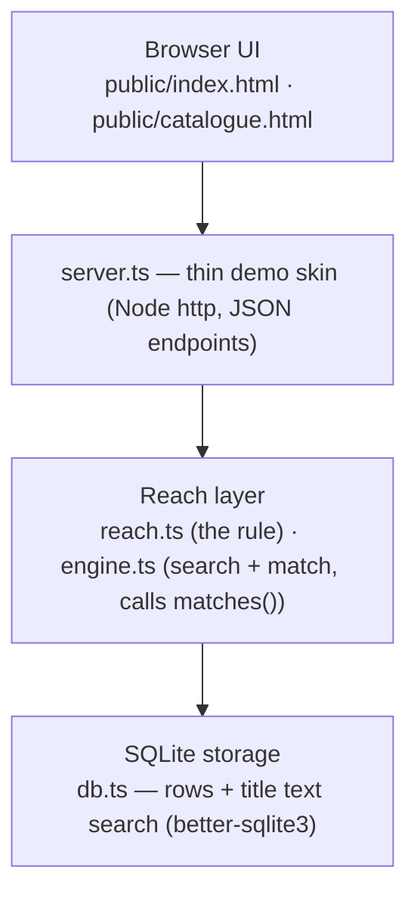

# Within Reach — reference implementation

This is an illustrative reference for the **reach layer**, not a deployable product
and not a marketplace. It exists to show one thing holds up as code: each party has
two fields — `location` and `reach` — and a listing is visible only when both sides
cover the same ground:

```
visible = (seller.location within buyer.reach) and (buyer.location within seller.reach)
```

That rule lives in one place (`reach.ts`). Everything else here — storage, a text
search, a web viewer — exists only to put the rule in front of you.

## The layer cake



- The **reach layer** is the only new part. `reach.ts` holds `within()` and
  `matches()`; `engine.ts` does the search/match orchestration and defers every
  visibility decision to `matches()`. No reach logic touches SQL.
- **SQLite** stores parties, postcodes and listings, and does one thing for the
  rule: a case-insensitive `LIKE` filter on listing titles. It never decides
  visibility.
- The **commerce engine** — accounts, carts, payments, the actual marketplace — is
  assumed forked from an existing open-source platform and is **not built here**.
  `server.ts` is that engine stubbed to the thinnest skin that shows the reach layer:
  a few JSON endpoints and two static pages.

## File map

| File | Purpose |
| --- | --- |
| `reach.ts` | The library. The four reach tiers, `within()`, `matches()` (the rule), `distanceKm()`, `usableReach()`. The only distinctive code. |
| `demo.ts` | Worked examples that double as a self-check — every line prints `PASS`. The canonical cases from the white paper. |
| `db.ts` | SQLite schema, `openDb()`, party hydration into reach-layer types, and the title text-search query (`findCandidates`). |
| `engine.ts` | The forked-engine stub: `search()`, `matchSellers()`, `catalogue()`. Calls `matches()` for every visibility call; no reach logic of its own. |
| `seed.ts` | Drops and rebuilds `within-reach.db` from `seed-data.json`. |
| `seed-data.json` | The dataset: postcodes, buyers, sellers and listings. Edit it to change the world. |
| `server.ts` | Dependency-free Node `http` server. Serves the two pages and the JSON endpoints. |
| `public/index.html` | The match explorer: pick a buyer, search a term, see what the rule lets through and what it hides (with reasons). |
| `public/catalogue.html` | The full catalogue, grouped by seller — every listing, no reach rule applied. |

## How to run

TypeScript, dependency-light: `better-sqlite3` for storage, `tsx` to run.

```sh
npm install      # better-sqlite3 + tsx
npm run demo     # the self-check — every case should print PASS
npm run seed     # build within-reach.db from seed-data.json
npm run web      # serve the demo at http://localhost:8137
```

The server refuses to start without a database, so run `npm run seed` before
`npm run web`. The `.db` file is gitignored and rebuilt by the seed step, so it is
disposable — reseeding is clean and reproducible.

Override the port with `PORT`:

```sh
PORT=8200 npm run web
```

## Documents

- [./architecture.md](./architecture.md) — how the pieces fit: the layer cake, the request paths, where the rule sits.
- [./data-model.md](./data-model.md) — the `location` / `reach` fields, precision gating, and the SQLite schema.
- [./reach-layer.md](./reach-layer.md) — the rule itself: `within()`, `matches()`, the four tiers, and what `local` means.
- [./api-reference.md](./api-reference.md) — the JSON endpoints `server.ts` exposes and the shapes they return.

## White paper

The idea in full: [../whitepaper/within-reach-whitepaper.md](../whitepaper/within-reach-whitepaper.md).
