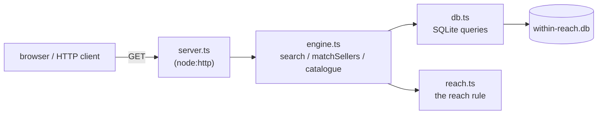
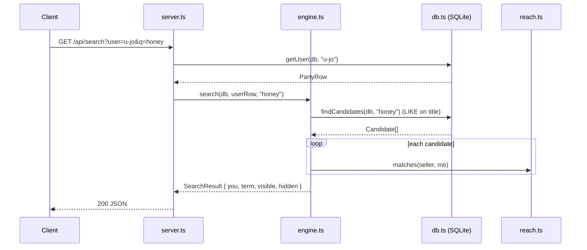
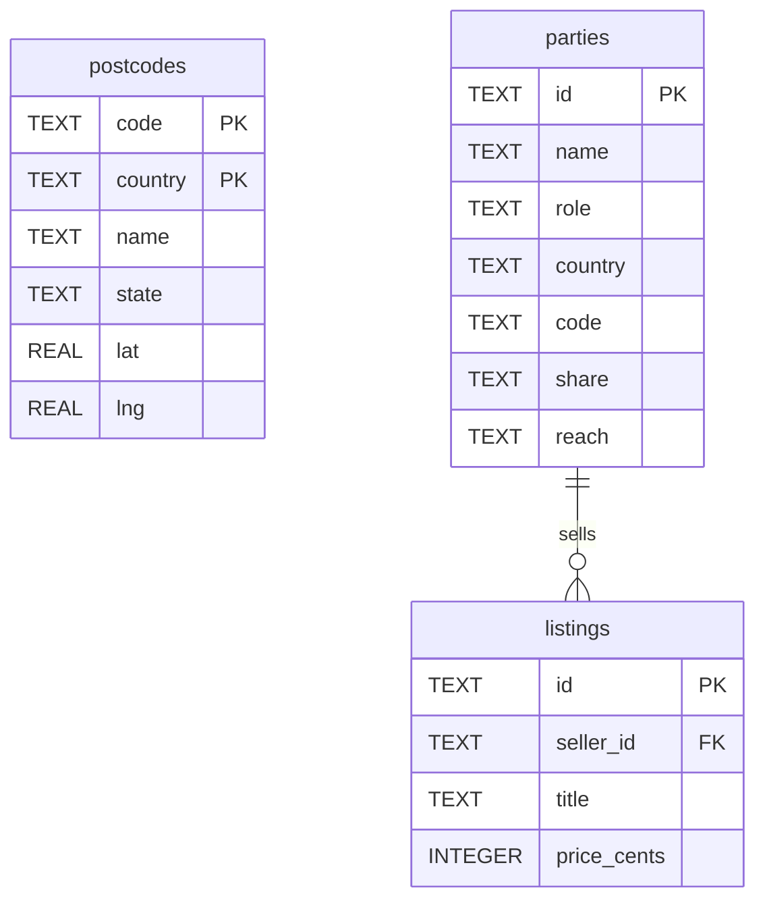

# API reference — reference implementation

This documents the HTTP API and the code modules of the **Within Reach** reference, the
small TypeScript demo under `reference/`. It is illustrative, not a deployable product:
SQLite stores rows and does title text search, but the reach rule itself lives only in
`reach.ts`. Everything below is described from the source as it stands — no planned or
imagined behaviour.

For the idea behind it, see the white paper at
[`../whitepaper/within-reach-whitepaper.md`](../whitepaper/within-reach-whitepaper.md). For the
normative data model and rule (when it exists), see [`./reach-layer.md`](./reach-layer.md).

## Running it

```sh
cd reference
npm install
npm run seed     # build within-reach.db from seed-data.json
npm run web      # start the server
```

The server listens on `8137` by default; override with `PORT`:

```sh
PORT=8200 npm run web
```

It exits early if no database exists — run `npm run seed` first. If the port is taken it
prints a hint and exits.

## How the pieces fit



SQLite does one thing only: a case-insensitive `LIKE` on listing titles. Visibility is
decided afterwards in TypeScript by `matches()` from `reach.ts`. There is deliberately no
country pre-filter in SQL — a worldwide buyer wants other countries too, so filtering there
would silently break the rule.

---

# Part A — HTTP endpoints

All JSON responses are sent with `Content-Type: application/json; charset=utf-8`. The two
page routes return HTML. Anything not listed returns `404 Not found` (plain text). Only
`GET` is handled.

The two endpoints that take a `user` parameter resolve it against buyers only (rows with
`role = 'user'`), via `getUser`. An unknown id is a `400`.

## GET / — viewer page

Serves `public/index.html`. Pick who you are, type a term, see the listings the reach rule
lets through. `GET /index.html` is an alias.

- **Response:** `200`, `text/html; charset=utf-8`.

## GET /catalogue — full-catalogue page

Serves `public/catalogue.html` — every listing, no reach rule applied. `GET /catalogue.html`
is an alias.

- **Response:** `200`, `text/html; charset=utf-8`.

## GET /api/users — buyers you can act as

Lists buyers with their home town and which reach tiers their shared precision actually
allows (`usableReach(location)` from `reach.ts`).

- **Query params:** none.
- **Response shape:**

```jsonc
{
  "users": [
    {
      "id": "u-mia",
      "name": "Mia",
      "town": "Queanbeyan, NSW",
      "reach": "local",
      "usable": ["local", "state", "country", "worldwide"]
    }
  ]
}
```

Field notes: `town` is a human-readable home (e.g. `"Canberra, ACT"`, or just the country
when the buyer shares country only). `reach` is the buyer's chosen tier. `usable` is the set
of tiers their precision permits.

## GET /api/sellers — every seller, plain

The seller list with no buyer chosen and no reach evaluation. Used for the right-hand column
before a buyer is picked.

- **Query params:** none.
- **Response shape:**

```jsonc
{
  "sellers": [
    { "id": "s-brindabella", "name": "Brindabella Apiary", "town": "Canberra, ACT", "reach": "local" }
  ]
}
```

## GET /api/match — sellers scored against a buyer

Runs the reach rule for one buyer against **every** seller, with no search term. Backed by
`matchSellers` in `engine.ts`.

- **Query params:**
  - `user` (required) — buyer id. Resolved with `getUser`.
- **Errors:**
  - `400 { "error": "Unknown user" }` — id missing or not a buyer.
- **Response shape:**

```jsonc
{
  "you": {
    "id": "u-mia",
    "name": "Mia",
    "town": "Queanbeyan, NSW",
    "reach": "local",
    "usable": ["local", "state", "country", "worldwide"]
  },
  "sellers": [
    {
      "id": "s-brindabella",
      "name": "Brindabella Apiary",
      "town": "Canberra, ACT",
      "reach": "local",
      "matched": false,
      "distanceKm": 18,
      "detail": "they sit outside your [local] reach"
    }
  ]
}
```

Field notes per seller: `matched` is the boolean result of `matches(seller, you)`.
`distanceKm` is the great-circle distance between the two locations, rounded, or `null` when
either side lacks lat/lng. `detail` carries the reach tiers in play when matched
(`your [local] ∩ their [country]`), or the reason it failed when not — one or both of
`they sit outside your [<tier>] reach` and `you sit outside their [<tier>] reach`, joined
with `and`.

- **Example:** `GET /api/match?user=u-jo`

## GET /api/search — search as a buyer

Text-matches listing titles, then keeps only those whose seller passes
`matches(seller, you)`. Returns both the visible set and the hits that were filtered out
(with the reason), so the rule's working is visible. Backed by `search` in `engine.ts`.

- **Query params:**
  - `user` (required) — buyer id.
  - `q` (required) — search term; trimmed before use.
- **Errors:**
  - `400 { "error": "Unknown user: <id>" }` — `user` missing or not a buyer (shows `(none)`
    when empty).
  - `400 { "error": "Empty search term" }` — `q` missing or whitespace only. The user check
    runs first.
- **Response shape:**

```jsonc
{
  "you": {
    "id": "u-jo",
    "name": "Jo",
    "town": "Sydney, NSW",
    "reach": "country",
    "usable": ["local", "state", "country", "worldwide"]
  },
  "term": "honey",
  "visible": [
    {
      "id": "s-brindabella-001",
      "title": "Raw wildflower honey 500g jar",
      "priceCents": 1600,
      "price": "$16.00",
      "sellerId": "s-brindabella",
      "seller": "Brindabella Apiary",
      "town": "Canberra, ACT",
      "sellerReach": "local",
      "tier": "your [country] ∩ their [local]",
      "distanceKm": 248
    }
  ],
  "hidden": [
    {
      "id": "s-overseas-014",
      "title": "Manuka honey gift box",
      "sellerId": "s-overseas",
      "seller": "Kauri Honey Co",
      "town": "NZ",
      "reason": "they sit outside your [country] reach and you sit outside their [country] reach"
    }
  ]
}
```

Field notes: `price` is `priceCents` formatted as `$X.XX`. `visible` is sorted nearest-first
by `distanceKm`; anything with unknown distance falls in behind. `tier` is the matched-reach
label; `reason` (on hidden hits) is the failure explanation. Both come from the same logic as
`/api/match`.

- **Example:** `GET /api/search?user=u-jo&q=honey`

## GET /api/catalogue — every listing, no rule

The whole catalogue grouped by seller, with the reach rule **not** applied. Backed by
`catalogue` in `engine.ts`.

- **Query params:** none.
- **Response shape:**

```jsonc
{
  "total": 600,
  "sellers": 20,
  "groups": [
    {
      "id": "s-brindabella",
      "name": "Brindabella Apiary",
      "town": "Canberra, ACT",
      "reach": "local",
      "country": "AU",
      "listings": [
        { "id": "s-brindabella-001", "title": "Raw wildflower honey 500g jar", "price": "$16.00", "priceCents": 1600 }
      ]
    }
  ]
}
```

Field notes: `total` is the listing count, `sellers` the group count. Listings are ordered by
title; a seller with no listings gets an empty `listings` array.

## Request flow



---

# Part B — module reference

Three modules sit between the server and the reach layer. Import paths in the source use the
`.js` extension (ESM/`tsx` convention); the files are `.ts`.

## db.ts — storage and hydration

SQLite holds the data and does the text search on titles. It does not decide visibility.
Rows are hydrated into reach-layer types here so `engine.ts` can call `matches()`.

### Schema



`postcodes` has a composite primary key `(country, code)`. `parties.role` is checked to
`('user','seller')`, `share` to `('country','state','postcode')`, and `reach` to
`('local','state','country','worldwide')`. `listings.seller_id` references `parties(id)`.
There is no foreign key from `parties` to `postcodes` — a party's `(country, code)` is looked
up against `postcodes` at hydration time.

### Exports

```ts
const DB_PATH: string            // join(__dirname, "within-reach.db")
const SCHEMA: string             // the CREATE TABLE statements above

function openDb(): Database.Database
// Opens DB_PATH and turns on PRAGMA foreign_keys = ON.

type Share = "country" | "state" | "postcode"
// How much of a participant's location they chose to share. Gates reach precision.

interface PartyRow {
  id: string;
  name: string;
  role: "user" | "seller";
  country: string;
  code: string | null;
  share: Share;
  reach: ReachTier;            // from reach.ts
}

interface HydratedParty extends Party {   // Party from reach.ts
  id: string;
  name: string;
  town: string;                // e.g. "Canberra, ACT", or the country if share="country"
}

function hydrate(db: Database.Database, party: PartyRow): HydratedParty
// Looks up the party's postcode (if any) and builds a reach-layer Location, masking
// fields the participant didn't share. This is where precision-gating happens:
// share="country" yields a country-only Location, so usableReach() refuses local/state.

function listUsers(db: Database.Database): PartyRow[]   // role='user', ordered by name
function getUser(db: Database.Database, id: string): PartyRow | undefined  // a buyer by id
function listSellers(db: Database.Database): PartyRow[] // role='seller', ordered by name

interface Candidate {
  id: string;
  title: string;
  priceCents: number;
  seller: HydratedParty;       // matched the text, not yet reach-checked
}

function findCandidates(db: Database.Database, term: string): Candidate[]
// Listings whose title contains `term`, case-insensitive:
//   WHERE l.title LIKE '%' || ? || '%' COLLATE NOCASE
// joined to their seller and ordered by title. This is the ONLY filter SQL applies;
// no country pre-filter, deliberately.
```

`PostcodeRow`, `hydrateLocation`, and `townLabel` are internal (not exported).

## engine.ts — the search step

Framing-free search reused by the server. SQLite finds candidates by text; this module
applies the reach rule by calling `matches()` from `reach.ts`. Nothing about reach lives in
SQL, and `within()` / `matches()` / `distanceKm()` are not reinvented here.

### Result interfaces

```ts
interface VisibleResult {
  id: string;
  title: string;
  priceCents: number;
  price: string;               // "$X.XX"
  sellerId: string;
  seller: string;
  town: string;
  sellerReach: string;
  tier: string;                // e.g. "your [local] ∩ their [country]"
  distanceKm: number | null;
}

interface HiddenResult {
  id: string;
  title: string;
  sellerId: string;
  seller: string;
  town: string;
  reason: string;              // which side of the rule said no
}

interface SearchResult {
  you: { id: string; name: string; town: string; reach: string; usable: string[] };
  term: string;
  visible: VisibleResult[];
  hidden: HiddenResult[];
}

interface SellerMatch {
  id: string;
  name: string;
  town: string;
  reach: string;
  matched: boolean;
  distanceKm: number | null;
  detail: string;              // tier if matched, reason if not
}

interface CatalogueGroup {
  id: string;
  name: string;
  town: string;
  reach: string;
  country: string;
  listings: Array<{ id: string; title: string; price: string; priceCents: number }>;
}
```

### Functions

```ts
function search(db: Database.Database, userRow: PartyRow, term: string): SearchResult
// Text-match listings via findCandidates, keep those where matches(seller, me) holds,
// record the rest as hidden with a reason. visible is sorted nearest-first by distanceKm.

function matchSellers(
  db: Database.Database,
  userRow: PartyRow,
): { you: SearchResult["you"]; sellers: SellerMatch[] }
// Evaluate the reach rule for one buyer against every seller, no search term.
// Same matches() call as search, run over the seller list instead of over text hits.

function catalogue(
  db: Database.Database,
): { total: number; sellers: number; groups: CatalogueGroup[] }
// Every listing grouped by seller, ordered by title. No reach rule applied.
```

`money`, `whyVisible`, and `whyHidden` are internal helpers. `whyVisible` builds the
`your [..] ∩ their [..]` tier string; `whyHidden` re-checks each side with `within()` to
produce the reason.

## seed.ts — build the database

A script (no exports), run via `npm run seed`. It reads `seed-data.json` — postcodes,
buyers, sellers, and listings — then:

1. Deletes `within-reach.db` if it exists.
2. Opens a fresh database and runs `SCHEMA`.
3. Inserts every postcode, party (buyers as `role='user'`, sellers as `role='seller'`), and
   listing inside a single transaction.

The result is a clean, reproducible rebuild — edit the JSON to change the world. The bundled
dataset is 15 postcodes, 10 buyers, 20 sellers, and 600 listings. It prints a summary and a
hint to start the server.

---

## Notes on accuracy

Every endpoint, parameter, signature, and field above is taken directly from
`reference/server.ts`, `reference/engine.ts`, `reference/db.ts`, and `reference/seed.ts`.
The example ids and titles (`u-mia`, `s-brindabella`, `Raw wildflower honey 500g jar`) come
from `reference/seed-data.json`. The reach rule itself — `within`, `matches`, `usableReach`,
`distanceKm` — is defined in `reach.ts` and only called from these modules; see
[`./reach-layer.md`](./reach-layer.md) for its specification.
