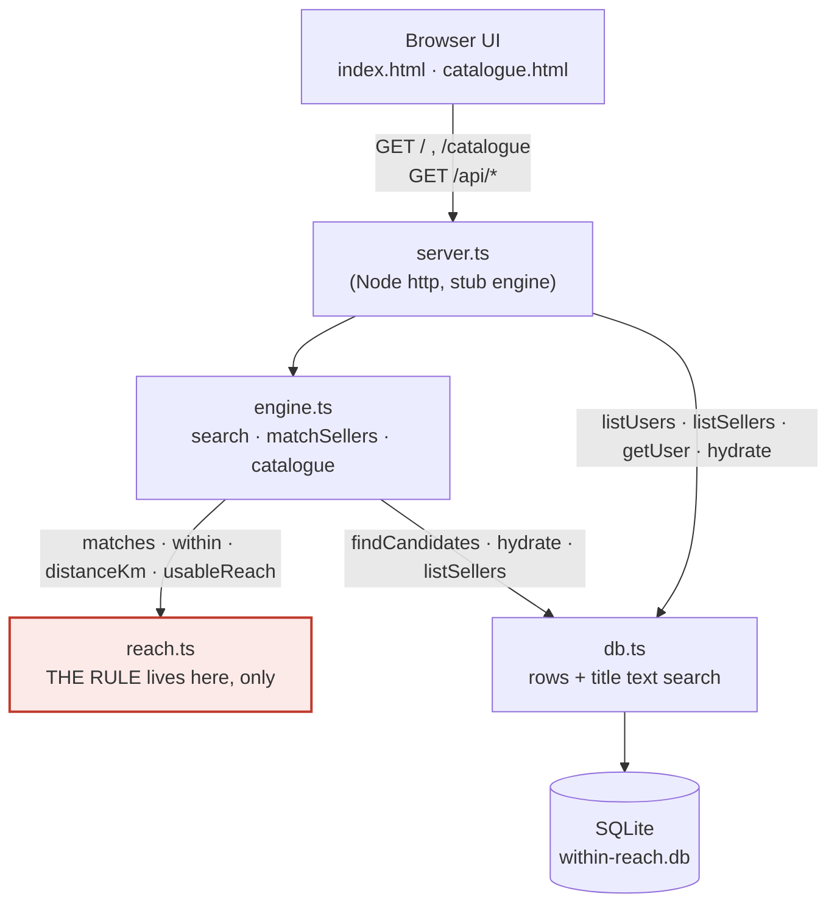
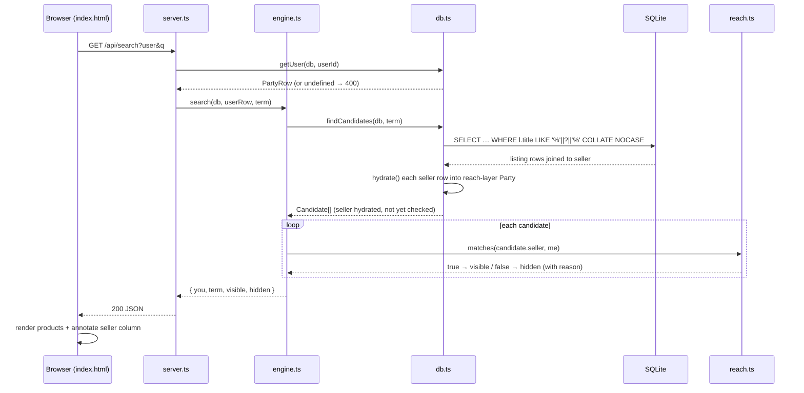
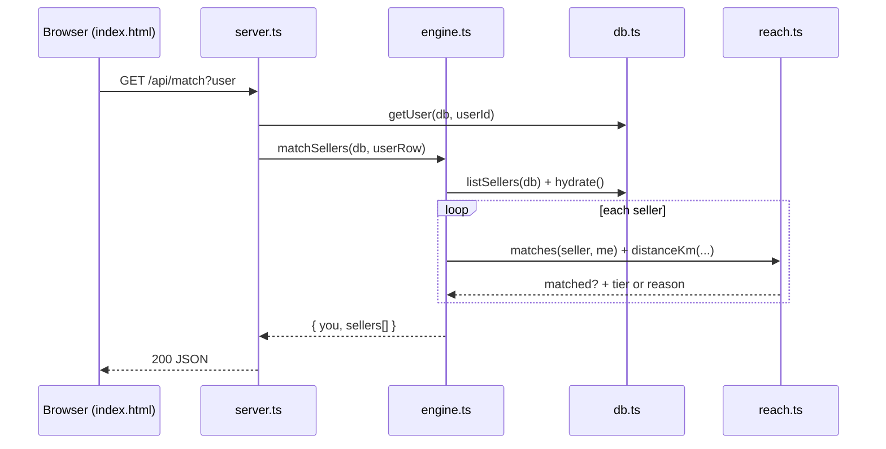

# Reference implementation — architecture

This describes how the `reference/` code is put together and how a request moves
through it. It is not a deployable marketplace. It is the thinnest stub that shows
the reach layer working over a seeded catalogue: pick a buyer, type a search term,
and watch the one rule decide what is visible.

For the idea itself, see [the white paper](../whitepaper/within-reach-whitepaper.md).
For the normative data model and rule, see [the reach-layer spec](./reach-layer.md).

## Three layers, plus a stub engine

The reference splits into three layers, in order of distance from the user:

1. **Browser UI** — two static pages, `public/index.html` (the match explorer) and
   `public/catalogue.html` (browse everything, no rule applied). Plain HTML and
   inline JavaScript that `fetch` JSON from the server and render it. No build step,
   no framework.
2. **The reach layer** — `reach.ts`. The two fields (`location`, `reach`) and the one
   rule. This is the only part that matters; everything else exists to feed it inputs
   and display its output.
3. **Storage** — `db.ts` over SQLite (`better-sqlite3`). Holds the rows and does the
   title text search. It decides nothing about visibility.

Between the UI and those layers sits `server.ts`: a Node `http` server with no
framework. It is the forked commerce "engine" stubbed down to almost nothing — it
moves rows and JSON around, serves two pages, and exposes a handful of `/api/*`
endpoints. A real marketplace would have accounts, carts, payments, and listings
management here; the reference deliberately has none of that. `engine.ts` holds the
small amount of search/match orchestration that a real engine would own, kept
separate from the HTTP plumbing.

The point of the split: the reach rule lives in exactly one file, and you can trace
every visibility decision back to it.

## Components

`engine.ts` calls into both `db.ts` (to fetch candidates and hydrate rows) and
`reach.ts` (to apply the rule). `server.ts` also touches `db.ts` directly for the
plain listing endpoints (`/api/users`, `/api/sellers`) and calls `usableReach` from
`reach.ts` when building the user list. SQL is reached only through `db.ts`.

## Module responsibilities

| Module | Owns |
| --- | --- |
| `server.ts` | Node `http` server. Serves `index.html` and `catalogue.html`; routes `GET /api/users`, `/api/sellers`, `/api/catalogue`, `/api/match`, `/api/search`. Validates query params, sends JSON. Refuses to start without a seeded DB. No reach logic of its own. |
| `engine.ts` | Search/match orchestration: `search()`, `matchSellers()`, `catalogue()`. Fetches candidates from `db.ts`, applies the rule by calling `matches()`/`within()`/`distanceKm()` from `reach.ts`, shapes the `{ you, visible, hidden }` result. Builds the human-readable "why" strings. Applies no rule itself — it only calls one. |
| `db.ts` | SQLite access. Owns the schema (`postcodes`, `parties`, `listings`), opens the DB, lists/gets parties, runs the title `LIKE` search (`findCandidates`), and hydrates rows into reach-layer types (`hydrate`), masking fields the participant did not share. The only filter it applies is the text match. |
| `reach.ts` | The reach layer. `Location`, `Party`, `ReachTier`; `within()`, `matches()` (the rule), `distanceKm()`, `usableReach()`, `LocalConfig`. Dependency-free. The sole home of the overlap rule. |
| `seed.ts` | Rebuilds `within-reach.db` from `seed-data.json` (15 postcodes, 10 buyers, 20 sellers, 600 listings). Drops and re-inserts inside one transaction so reseeding is clean. Run via `npm run seed`. |

## A search, end to end

`GET /api/search?user=<id>&q=<term>` as a chosen buyer.

The division of labour is the whole point: SQL narrows the catalogue by **text only**
(`findCandidates` in `db.ts`). The **reach rule** runs afterwards in TypeScript, once
per candidate, via `matches()` in `reach.ts`. Visible results are sorted nearest-first
when distance is known. Hits that fail the rule are not dropped silently — they go into
`hidden` with a reason string (`whyHidden`) so the demo can show the rule excluding
things, not just including them.

## Matching every seller

`GET /api/match?user=<id>` does the same rule, but over the seller list instead of over
text hits. The browser calls it the moment you pick a buyer, to light up the reachable
sellers before any search.

`matchSellers` calls the identical `matches()` as `search` — the only difference is
what it iterates over. "Reachable" is therefore a property of the buyer–seller *pair*,
and the set changes completely when you switch buyer.

## The invariant

One rule, one home, no shortcuts:

- **The reach/overlap rule lives only in `reach.ts`.** `matches()` is the rule;
  `within()` is its half. Nothing in `engine.ts`, `db.ts`, or `server.ts` reimplements
  containment — they call into `reach.ts` or they hand it inputs.
- **SQL does storage and title text search only.** `findCandidates` filters with
  `WHERE l.title LIKE '%' || ? || '%' COLLATE NOCASE` and nothing else. Hydration in `db.ts`
  masks unshared location fields, which is what makes `usableReach()` honest, but it
  applies no visibility logic.
- **The coarse country pre-filter is deliberately not applied.** It would be the obvious
  optimisation — only fetch sellers in the buyer's country — and it is wrong. A
  `worldwide` buyer wants other countries too, so a country filter in SQL would silently
  break the rule for exactly the case the model exists to handle. The candidate set stays
  country-blind on purpose; `matches()` makes the call. The comment on `findCandidates`
  in `db.ts` says as much.

If you change the rule, change it in `reach.ts`, and make the demo
(`npm run demo`) still print PASS on every line — adding a case for whatever you changed.
