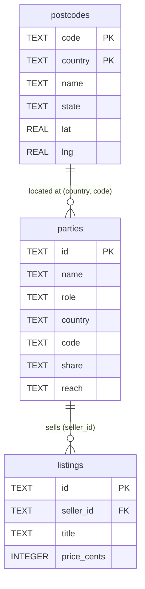

# Data model — reference implementation

This describes the storage layer of the *Within Reach* reference: the three SQLite
tables, and how rows are turned into the reach-layer types that `reach.ts` works on.

It is documentation of the reference, not a spec. The normative model is the reach
layer itself; see [`reach.ts`](../reference/reach.ts) and the
[white paper](../whitepaper/within-reach-whitepaper.md). A formal `reach-layer.md`
spec is a likely next step but does not exist yet.

The point to keep in view: **SQLite stores rows and does title text search; it never
decides visibility.** The reach rule lives only in `reach.ts`. The database is a coarse
text filter and a place to put rows — nothing more. `db.ts` hydrates rows into
`reach.ts`'s `Location`/`Party` types and `matches()` makes the call.

## Tables

Three tables: `postcodes`, `parties`, `listings`.



The `listings.seller_id -> parties.id` link is a real foreign key. The
`parties.(country, code) -> postcodes.(country, code)` link is conceptual: it is how
`hydrate()` looks a party's town up, but it is **not** declared as a foreign-key
constraint in the schema, and `parties.code` is nullable (a country-only party has no
postcode).

## Schema

Copied verbatim from the `SCHEMA` constant in [`db.ts`](../reference/db.ts):

```sql
CREATE TABLE postcodes (
  code    TEXT NOT NULL,
  country TEXT NOT NULL,
  name    TEXT NOT NULL,
  state   TEXT,
  lat     REAL,
  lng     REAL,
  PRIMARY KEY (country, code)
);

CREATE TABLE parties (
  id      TEXT PRIMARY KEY,
  name    TEXT NOT NULL,
  role    TEXT NOT NULL CHECK (role IN ('user','seller')),
  country TEXT NOT NULL,
  code    TEXT,
  share   TEXT NOT NULL CHECK (share IN ('country','state','postcode')),
  reach   TEXT NOT NULL CHECK (reach IN ('local','state','country','worldwide'))
);

CREATE TABLE listings (
  id         TEXT PRIMARY KEY,
  seller_id  TEXT NOT NULL REFERENCES parties(id),
  title      TEXT NOT NULL,
  price_cents INTEGER NOT NULL
);
```

`openDb()` opens the database at `within-reach.db` (next to `db.ts`) and runs
`PRAGMA foreign_keys = ON`, so the `listings.seller_id` reference is enforced.

## Columns

### `postcodes`

A lookup table of places. The reference geography lives here so that `parties` can
store nothing more than a `(country, code)` pair.

| Column    | Type | Notes |
|-----------|------|-------|
| `code`    | TEXT | The postcode. Part of the composite primary key. |
| `country` | TEXT | Country code, e.g. `AU`. Part of the composite primary key. |
| `name`    | TEXT | Human-readable place name, e.g. `Canberra`. |
| `state`   | TEXT | State/region, nullable. Needed for the `state` reach tier and for the town label. |
| `lat`     | REAL | Postcode-centroid latitude, nullable. Used for radius-based `local`. |
| `lng`     | REAL | Postcode-centroid longitude, nullable. |

Primary key is `(country, code)` — a postcode is only unique within a country.

### `parties`

Both sides of a trade live in one table, separated by `role`. A party stores its
location as a `(country, code)` reference into `postcodes`, plus the two reach-layer
fields: how much of that location it shares, and how far it reaches.

| Column    | Type | Notes |
|-----------|------|-------|
| `id`      | TEXT | Primary key. |
| `name`    | TEXT | Display name. |
| `role`    | TEXT | `'user'` or `'seller'` (CHECK-constrained). The buyer/seller discriminator. |
| `country` | TEXT | Country code. Always present — the coarsest unit. |
| `code`    | TEXT | Postcode, nullable. Null for a country-only party. |
| `share`   | TEXT | `'country'`, `'state'`, or `'postcode'` (CHECK-constrained). How much of the location is exposed. |
| `reach`   | TEXT | `'local'`, `'state'`, `'country'`, or `'worldwide'` (CHECK-constrained). The reach tier. |

Note that `country` is stored directly on the party as well as being part of the
`postcodes` key. A country-only party (`code` null) still has a country to match on.

### `listings`

What a seller offers. Deliberately thin — the reference cares about visibility, not
catalogue richness.

| Column        | Type    | Notes |
|---------------|---------|-------|
| `id`          | TEXT    | Primary key. |
| `seller_id`   | TEXT    | Foreign key into `parties(id)`. The seller. |
| `title`       | TEXT    | Listing title. The only field SQL searches on. |
| `price_cents` | INTEGER | Price in cents. |

## `role` and `share`

Two discriminator columns on `parties` carry most of the meaning.

**`role`** distinguishes buyers from sellers:

- `'user'` — a buyer. Queried by `listUsers()` / `getUser()`.
- `'seller'` — a seller. Queried by `listSellers()`, and joined onto listings by
  `findCandidates()`.

It is the same table and the same hydration on both sides; only the query filters
differ. The reach rule in `matches(seller, buyer)` is symmetric in structure, so a
seller and a buyer are the same shape of thing.

**`share`** records how much of its location a party chose to expose. This is the
privacy/precision dial:

- `'country'` — only the country is shared. The town label falls back to the bare
  country, and the hydrated `Location` carries nothing finer than `country`.
- `'state'` — country and state are shared (postcode is not). Enough for the `state`
  reach tier.
- `'postcode'` — full precision: country, state, postcode, and centroid lat/lng if the
  postcode row has them. Enough for `local`.

`share` is the *stored intent*; the actual masking happens in hydration, below.

## Precision gating

`hydrate()` in `db.ts` turns a `PartyRow` into a `HydratedParty` (a `Party` plus
`id`, `name`, and a `town` label). The geography passes through `hydrateLocation()`,
which **masks fields the party did not share**:

```ts
function hydrateLocation(party: PartyRow, pc: PostcodeRow | undefined): Location {
  const loc: Location = { country: party.country };
  if (party.share === "country" || !pc) return loc;
  if (party.share === "state" || party.share === "postcode") {
    if (pc.state) loc.state = pc.state;
  }
  if (party.share === "postcode") {
    loc.postcode = pc.code;
    if (pc.lat != null) loc.lat = pc.lat;
    if (pc.lng != null) loc.lng = pc.lng;
  }
  return loc;
}
```

So the resulting `Location` only ever carries detail the party agreed to share, even
though the `postcodes` row it was built from holds more. `share='country'` (or a
missing postcode row) returns a country-only `Location` immediately; `'state'` adds the
state; `'postcode'` adds postcode and, when present, the centroid.

The gate then closes downstream. `usableReach()` in `reach.ts` reads the same
`Location` and decides which reach tiers are even on the menu:

```ts
export function usableReach(loc: Location): ReachTier[] {
  const tiers: ReachTier[] = ["worldwide", "country"];
  if (loc.state) tiers.push("state");
  if (loc.postcode) tiers.push("local");
  return tiers;
}
```

No `state` on the location, no `state` tier. No `postcode`, no `local` tier. The
precision you give is the precision you get.

### Worked example: a country-only buyer

Take a buyer stored as `share='country'`, `country='AU'`, with whatever postcode
`code`:

1. `hydrateLocation()` hits the `share === "country"` branch and returns
   `{ country: "AU" }` — state, postcode and centroid are all dropped, regardless of
   what the `postcodes` row holds.
2. `townLabel()` returns the bare country (`"AU"`) rather than a `"name, state"` label.
3. `usableReach({ country: "AU" })` returns `["worldwide", "country"]` — `state` and
   `local` are refused, because the location has no state and no postcode to draw those
   regions from.

The buyer can reach `country` or `worldwide`, and nothing tighter. That is the whole
point of gating: a party that won't say where it is can't ask to be matched locally.

## Seed dataset

The dataset lives in `seed-data.json`, shaped as
`{ postcodes[], users[], sellers[], listings[] }`:

- **15** postcodes
- **10** buyers (`users`, inserted with `role='user'`)
- **20** sellers (inserted with `role='seller'`)
- **600** listings (30 per seller)

`npm run seed` runs [`seed.ts`](../reference/seed.ts), which **drops** any existing
`within-reach.db`, recreates it from `SCHEMA`, and re-inserts the JSON inside a single
transaction. Reseeding is therefore clean and reproducible — to change the world, edit
`seed-data.json` and reseed.

`within-reach.db` is a build artefact and is gitignored; only the JSON seed is checked
in. The seed script prints the counts and points you at `npm run web` to start the demo.

## Text search vs visibility

The one query that joins listings to sellers, `findCandidates()`, applies a single SQL
filter:

```sql
WHERE l.title LIKE '%' || ? || '%' COLLATE NOCASE
```

That is a case-insensitive substring match on the title and nothing else.
Deliberately, there is **no country pre-filter in SQL** — a worldwide buyer wants
other countries too, so filtering by country here would silently break the rule.
Candidates come back hydrated but not yet reach-checked; visibility is decided
afterwards in TypeScript by `matches()`. The database narrows by text; `reach.ts`
narrows by geography.
