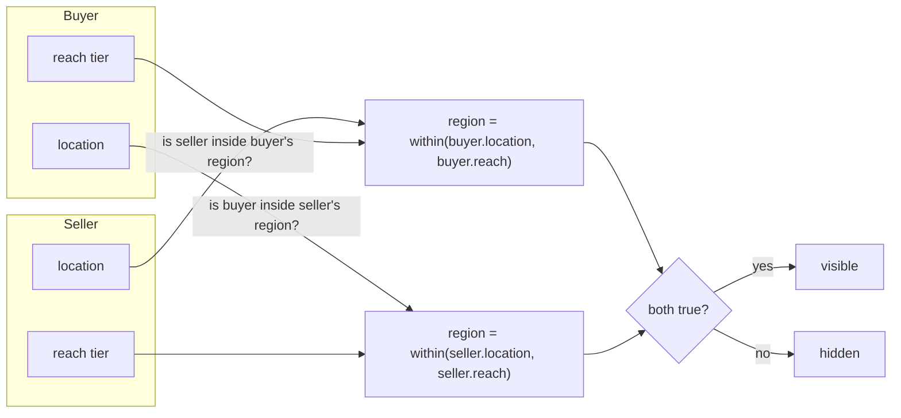
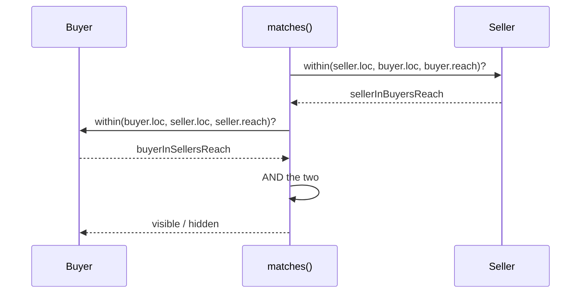

# The reach layer

This documents [`reference/reach.ts`](../reference/reach.ts) — the one new part of Within Reach.
Everything else (listings, accounts, carts, payments) is assumed forked from an existing commerce
engine and is out of scope. What follows is the whole novel surface: **two fields on each party**
(`location`, `reach`) and **one rule**.

For the idea in full, see the white paper: [`../whitepaper/within-reach-whitepaper.md`](../whitepaper/within-reach-whitepaper.md).

The reference is illustrative, not a deployable product. SQLite (`better-sqlite3`) stores rows and
does the title text search; the reach rule lives only in `reach.ts` and touches no database.

## The shape, in one diagram

A reach tier is not an absolute area. It is read **outward** from a party's own location into a
region, and a match fires only when each party's location sits inside the other's region.



## ReachTier — the four tiers

```ts
export type ReachTier = "local" | "state" | "country" | "worldwide";
```

Four tiers, coarsening from `local` to `worldwide`. `worldwide` is not "everywhere" as a place —
it is simply the absence of a limit. The tier stores no place name of its own; the region is always
derived from the party's `location`.

## Location — precision you share is precision you get

```ts
export interface Location {
  country: string;   // e.g. "AU"
  state?: string;    // e.g. "ACT"
  postcode?: string; // e.g. "2600"
  lat?: number;      // postcode centroid latitude
  lng?: number;      // postcode centroid longitude
}
```

`country` is always required — the coarsest unit. The rest are optional, and each one unlocks a tier:

| Field present | Unlocks |
| --- | --- |
| `country` (always) | `worldwide`, `country` |
| `state` | `state` |
| `postcode` | `local` (the exact same-postcode floor) |
| `lat` + `lng` (postcode centroid) | radius-based `local`, and a real distance readout |

`lat`/`lng` are the postcode centroid, not a precise home address. They sharpen `local` from an
exact postcode match into a radius, and they are what `distanceKm` needs to return a number.

## Party — one side of a trade

```ts
export interface Party {
  location: Location;
  reach: ReachTier;
}
```

Where you are, and how far you'll go. Both buyer and seller are `Party` values; the rule is symmetric
in type, even though the two roles read differently in prose.

## LocalConfig — what "local" means

```ts
export interface LocalConfig {
  radiusKm: number | null;
}

const DEFAULT_LOCAL: LocalConfig = { radiusKm: 25 };
```

`local` has two meanings, and the builder picks one:

- **`radiusKm: null`** — the day-one floor. "Local" is the *same postcode, exactly*. No geographic
  data needed, shippable immediately.
- **`radiusKm: number`** — "local" is everything within that many km of the party's own postcode
  centroid. Needs centroids, but it is the version that actually feels like "near me".

The default, used whenever a caller omits `local`, is **25 km**.

## within — read a tier outward into a region

```ts
export function within(
  target: Location,
  origin: Location,
  tier: ReachTier,
  local: LocalConfig = DEFAULT_LOCAL,
): boolean
```

Is `target` inside the region you get by reading `origin`'s location out to `tier`? The tier is
measured *from* the origin: "country" means *origin's* country, "local" means the area around
*origin*. Tier plus location becomes a concrete region; containment is whether `target` falls inside it.

| Tier | Returns true when |
| --- | --- |
| `worldwide` | always — no limit, everyone is inside |
| `country` | `target.country === origin.country` |
| `state` | same country **and** `origin.state` is set **and** `target.state === origin.state` |
| `local` (`radiusKm: null`) | `origin.postcode` is set **and** `target.postcode === origin.postcode` |
| `local` (`radiusKm: n`) | `distanceKm(origin, target) <= n` |

The `state` tier needs the origin's state to draw a region at all; without `origin.state` it is false.

For radius-based `local`, if either side lacks a centroid then `distanceKm` returns `null`, and
`within` **falls back to the exact same-postcode floor** rather than over-matching. Missing geo data
narrows the result, it never widens it.

## matches — THE RULE

```ts
export function matches(
  seller: Party,
  buyer: Party,
  local: LocalConfig = DEFAULT_LOCAL,
): boolean {
  const sellerInBuyersReach = within(seller.location, buyer.location, buyer.reach, local);
  const buyerInSellersReach = within(buyer.location, seller.location, seller.reach, local);
  return sellerInBuyersReach && buyerInSellersReach;
}
```

In one line:

```
visible = (seller.location within buyer.reach) and (buyer.location within seller.reach)
```

Both directions must hold. The seller must sit inside the buyer's reach region, **and** the buyer
must sit inside the seller's reach region. Both sides have to say yes to the same geography. A seller
casting `worldwide` is still invisible to a buyer who only looks `local` unless the seller is also
genuinely local to that buyer — width on one side never overrides narrowness on the other. This is
where size-neutrality comes from: a party is reachable by choice of reach, not by scale.



## usableReach — precision gates the menu

```ts
export function usableReach(loc: Location): ReachTier[] {
  const tiers: ReachTier[] = ["worldwide", "country"];
  if (loc.state) tiers.push("state");
  if (loc.postcode) tiers.push("local");
  return tiers;
}
```

Which tiers a party can actually select, given the precision they shared. `worldwide` and `country`
are always available. `state` appears only with a `state`; `local` only with a `postcode`. Share just
a country and `state`/`local` are not on the menu for you.

From the demo:

- `usableReach({ country: "AU" })` → `worldwide, country`
- `usableReach(canberra)` (full postcode) → `worldwide, country, state, local`

## distanceKm — great-circle, or null

```ts
export function distanceKm(a: Location, b: Location): number | null
```

Haversine great-circle distance in km (Earth radius 6371 km) between two centroids. Returns `null` if
either location is missing `lat` or `lng` — a `null`, not a guess. Used both by radius-based `local`
inside `within`, and by the interactive search demo to show "X km away".

## Tier truth-table

Where the other party sits, against the reach a party has chosen. "Local (radius)" assumes the default
25 km and that both sides have centroids; without centroids it collapses to the same-postcode column.

| Reach \ Other party is… | Same postcode | Same state, ≤ radius | Same state, > radius | Same country, other state | Other country |
| --- | --- | --- | --- | --- | --- |
| `local` (`null`) | ✅ | ❌ | ❌ | ❌ | ❌ |
| `local` (radius) | ✅ | ✅ | ❌ | depends on distance | ❌ |
| `state` | ✅ | ✅ | ✅ | ❌ | ❌ |
| `country` | ✅ | ✅ | ✅ | ✅ | ❌ |
| `worldwide` | ✅ | ✅ | ✅ | ✅ | ✅ |

Note the radius row: `local` is *distance*, not an administrative boundary, so a point in another
state but within range still matches, while a far point in the same state does not.

## Worked examples

These are taken from [`reference/demo.ts`](../reference/demo.ts), which doubles as a self-check —
run `cd reference && npm install && npm run demo` and every line should print `PASS`. Centroids there
are approximate, enough to show the behaviour without a postcode dataset.

```ts
const canberra   = { country: "AU", state: "ACT", postcode: "2600", lat: -35.28, lng: 149.13 };
const queanbeyan = { country: "AU", state: "NSW", postcode: "2620", lat: -35.35, lng: 149.23 }; // ~12 km
const sydney     = { country: "AU", state: "NSW", postcode: "2000", lat: -33.87, lng: 151.21 }; // ~250 km
const london     = { country: "GB", state: "ENG", postcode: "EC1A", lat:  51.52, lng:  -0.10 };
```

**1. Local cross-border match (~12 km).** A local-only seller in Canberra and a local-only buyer just
over the border in Queanbeyan. About 12 km apart — inside the 25 km radius — and it crosses a state
line, because local is distance, not boundary.

```ts
matches({ location: canberra, reach: "local" },
        { location: queanbeyan, reach: "local" }) // => true
```

**2. Worldwide ↔ worldwide.** Two parties on opposite sides of the planet, both `worldwide`: a clean
match. A one-person workshop competing globally from a single bench is exactly this case.

```ts
matches({ location: canberra, reach: "worldwide" },
        { location: london, reach: "worldwide" }) // => true
```

**3. Country-bounded seller invisible to an overseas buyer.** A national seller that bounds itself to
its own country (`reach: "country"`) does not match a buyer in another country — by its own choice,
not because it is small. This is size-neutrality in one line.

```ts
matches({ location: sydney, reach: "country" },
        { location: london, reach: "worldwide" }) // => false
```

**4. Proximity is still required on the buyer's side.** A national seller (`reach: "country"`) only
reaches a `local` buyer when the seller is genuinely in that buyer's local area. Wide reach on the
seller does not relax the buyer's `local`.

```ts
matches({ location: sydney, reach: "country" },
        { location: canberra, reach: "local" }) // => false (Sydney is not local to Canberra)

matches({ location: sydney, reach: "country" },
        { location: sydney, reach: "local" })   // => true  (same city)
```

**5. Distance readout.** `distanceKm` is a number when both centroids exist and `null` otherwise.

```ts
distanceKm(canberra, sydney)        // => ~250 (between 240 and 260)
distanceKm(canberra, { country: "AU" }) // => null
```

## See also

- [`../whitepaper/within-reach-whitepaper.md`](../whitepaper/within-reach-whitepaper.md) — the idea in full.
- [`../reference/reach.ts`](../reference/reach.ts) — the library documented here.
- [`../reference/demo.ts`](../reference/demo.ts) — the worked examples, runnable as a self-check.
