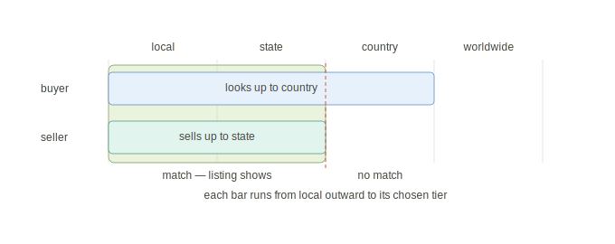
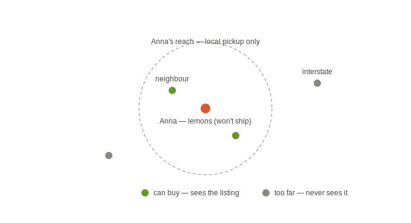
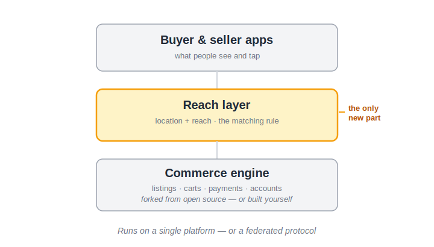
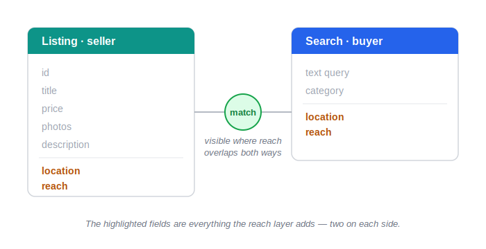
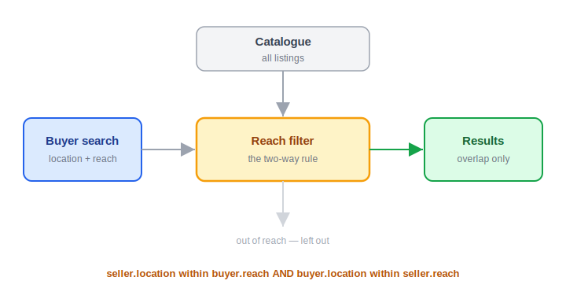

# Within Reach

*A local-first marketplace, worldwide by choice*

*Working draft — first full pass complete.*

---

## Abstract

Online marketplaces have quietly collapsed a rich question — *where* do you want to buy and sell — into a single answer: everywhere. The platforms that won default everyone into a global pool, because global scale is what serves them, and in doing so they erased the local option and left whole kinds of trade homeless: the produce that can't ship, the maker who only wants the next few suburbs, the buyer who'd rather keep their money close.

This paper sets out a different way to make a marketplace searchable, one that fits any goods or services. Buyer and seller each choose how far they'll reach — local, state, country, or worldwide — and a listing appears only where the two reaches overlap. It sorts by where you are and how far you'll go, never by who you are or how big, so the same rules serve a backyard grower and a national operation, and value stays as close to home as each side chooses. The build is modest — two fields and one matching rule on a forked open-source engine — and it bootstraps not by chasing global volume but by filling one local market at a time, seeded by communities that already exist. It's offered as a commons: published, open, and forkable, owned by no one because there is nothing to own.

This is a white paper, not a product, on purpose. The code is the easy part; the hard part is sustaining a living business around it, run for the people on it rather than at their expense — and that is work for someone better placed to do it. The idea is set down here, in full and for free, in the hope it inspires them.

---

## The Problem

A woman once bought one of my chopping boards on the spur of the moment, as a wedding present. She'd spotted it, decided it was perfect for a friend, and the wedding was that very weekend — so she needed it fast. I got it to her in time, she was thrilled, and once she had it in her hands and saw the work up close, she commissioned me to make a massive end-grain board for herself. Here's the part neither of us knew until afterwards: she lived a few suburbs away. The thing that turned a frantic one-off sale into a commission and a lasting connection — that we were practically neighbours — we fell into by accident. The platform that sold her that board had treated her as though she were on the other side of the world.

That's the thing we've quietly lost: the ability to buy from the people next to us. Online, where most buying now happens, "local" barely exists. Commerce got swallowed by a handful of enormous companies that sit between every buyer and every seller, take their cut, and send the value somewhere else. The maker three suburbs over, the grower down the road, the neighbour who'd gladly sell to you if only you could find them — they're invisible, buried under a hemisphere of listings you were never looking for. And what vanished with them wasn't just convenience. It was community: knowing who makes what nearby, keeping a little money moving between neighbours, supporting the person instead of the conglomerate.

You can feel that design in the tools. Selling those boards on Etsy, I never once felt I was reaching an Australian market — the only "local" on offer was the entire country, and the Australian makers competing beside me were nearly impossible to find. Tell eBay you want something nearby and, when it finds nothing, it won't say so plainly; it slips a tiny notice up the top and fills the page with international listings, and twenty minutes later you realise none of it was ever local. An American would never notice — for them, the global default *is* local. The whole system was built for one market, and everyone outside it pays a quiet tax, in wasted time and in lost connection.

It shouldn't take luck to find the neighbour with the thing you want. Picture the opposite: you open a marketplace and the first thing it shows you is what's *near* you. You find the maker, the grower, the person a few suburbs over. The money stays close to home. And anyone who wants to reach further still can — climbing outward to their state, their country, the world, on their own terms and their own timeline. Local first; global only by choice.

That's the thing that doesn't exist yet. This paper is about building it — and about giving it away, so no one can fence it off once it's built.

---

## Vision & First Principles

The problem was never that commerce went global. It's that *choice* went missing. The platforms we ended up with force everyone into one worldwide pool — whether you're a grower who only wants to sell to your own town or a maker chasing customers on the other side of the planet. You don't get to set your own reach. The platform sets it for you, and it always sets it to "everywhere," because everywhere is what keeps you scrolling.

This is a marketplace that hands the choice back. It serves the seller who wants the whole world exactly as well as the one who wants only their own street — and it sorts people by where they are, not by how big they are. It's built to belong to no one — open for any community to stand up its own, never a company in the middle taking a cut from both sides. Infrastructure, not a landlord.

The principles it's built on:

**You choose how far to reach — and it sticks.** Buyers set how far they'll look; sellers set how far they'll sell — the same control, mirrored on both sides of every trade. Local, state, country, worldwide: four rungs that differ only by distance, each a real and equal choice, and you save the one you want as your default. Set it to "just near me" every time, or to the whole world — your call. The nearby option the big platforms quietly removed is back on the menu, never forced on you.

**Value stays as close as you choose.** Keeping money close was never a local-only idea — it runs the whole length of the dial. Buy from your town and the value stays in your town; from your state and it stays in your state; from inside your own country and it stays home instead of going offshore; from the world when the world is what you want. Every rung keeps value nearer than the one above. The buyer decides how close, and where the money lands follows the choice.

**Where you are, not how big you are.** The dial sorts by location, and only location. A lone maker with something nobody else makes can reach the whole world; the largest company in your country can choose to sell only to people at home. Small is not the same as local, and large is not the same as global — that's a habit of mind, and the system doesn't share it. It asks where you are and how far you'll go, never how big you are. That neutrality is what lets a busy local market draw bigger sellers in rather than shut them out.

**Reach is a ladder you climb at your own pace.** A grower can sell to three streets and stop there forever. A maker can start in their town, prove it, and climb to state, country, and the world as they're ready. No rung is a push and none is a penalty — and the ladder runs both ways: as a small market fills, wider-reaching sellers climb down it to reach the buyers already gathered there.

**The precision you give is the precision you get.** Share your exact location and you unlock the nearest tier. Share only your country and that's the resolution you searched at. The same fair rule for buyer and seller — nobody forced to reveal more than they choose.

**Find it and leave.** Success is you getting what you came for and getting on with your day — not scrolling forever. The absence of friction is the point.

**Built for the edge of the map.** For the maker in the small town, the grower with a surplus, the seller the global platforms were never shaped to serve — including the things that can't ship at all, like fruit off your own trees.

**A commons, not a company.** Open, and owned by no one — any community can run its own, and the idea underneath can't be quietly bought and turned back into the thing it replaced. The protection is structural, not a promise on a webpage.

---

## How It Works

Two settings run the whole system — one for sellers, one for buyers — and they're mirror images of each other.

**Listing something (the seller).** You create a listing the way you would anywhere: title, photos, price, description. Then you set the two things the big platforms never ask you for. First, your location, as precisely as you're willing to give it — postcode for full local reach, or just your state or country if you'd rather not pin yourself down. Second, your *reach*: how far you're willing to sell. Local only, your state, your country, or the whole world. A grower with surplus sets "local only, pickup." A maker who ships nationwide sets "country." Change it whenever you like — which is the growth ladder in practice. Start local, and turn the dial up when you're ready.

**Finding something (the buyer).** You set your location the same way, and you set how far you're willing to look — the same four tiers. Search, and you see only the sellers whose reach overlaps with where you're looking. Set it to "local" and you get the makers and growers near you who chose to sell locally; set it to "worldwide" and the whole catalogue opens. Your setting sticks, so if local is all you ever want, you set it once and never wrestle a filter again.

**The rule that ties them together.** A listing appears for a buyer only when two things are both true: the seller sits inside the buyer's chosen distance, *and* the seller agreed to sell that far. Both sides have to say yes to the same geography. That's the whole matching logic — no hidden defaults, no quiet snap back to "worldwide," no page full of listings you never asked to see.

*Figure 1. A listing surfaces only where the buyer's reach and the seller's reach overlap. Each bar runs from local outward to its owner's chosen tier; the green band is where both cover the same ground, and the dashed line marks where the seller's reach stops.*

**The precision trade.** How local you can go depends on what you share. Give your postcode, and the local tier unlocks. Give only your country, and that's the finest resolution you get — the same fair rule for buyer and seller. Nobody's forced to reveal exactly where they live; they just trade precision for reach, with their eyes open.

**The thing the giants can't do.** Because the system is built around proximity and around sellers who can choose "local only, pickup," it carries what a global marketplace structurally can't: produce off a backyard tree, baked goods, seedlings, anything that won't survive a courier, anything handed over between neighbours. Amazon can't list your lemons. This can. For a lot of communities, that isn't a side feature — it's the point.

*Figure 2. Some goods can only be sold locally. Anna's lemons won't ship, so only buyers inside her reach ever see the listing — the one kind of trade no global marketplace can carry.*

---

## Who This Serves

The big platforms serve one kind of participant well: the one who wants the whole world, all the time. Everyone else is made to fit that mould or go without. This marketplace starts from the other end. Because it sorts people by where they are and how far they want to reach — never by who they are or how big — it fits a spectrum the global platforms flatten into a single setting. Here's who's on that spectrum.

**The sellers no global platform can host.** Start with the clearest case: the people whose goods can't travel. The grower with more than they can eat, the keeper with a dozen spare eggs, the gardener with seedlings, the baker, the person with something too heavy, too fresh, or too awkward to post. For them "local" isn't a preference they might toggle — it's the only way the sale can happen at all. The global marketplaces can't serve them, not because they won't, but because a courier and a catalogue can't carry a tray of eggs to the next street. This is the trade that has no home online today, and it's the one the model was shaped around first.

**The sellers who choose their own range.** Past that wedge sits everyone who *can* ship but wants to decide how far. The maker who starts in their own town, proves the thing sells, and climbs outward to state, country, and the world as they're ready — never forced to the deep end before they can swim. The one-person workshop turning out something nobody else makes, who sets reach to worldwide and competes globally from a single bench — small, and global, with no contradiction in it. The established operation that ships nationwide and sets its reach to its own country, not because it can't go further but because that's the market it wants — large, and deliberately bounded. The same dial serves all three. It asks how far, never how big.

**And not only goods.** None of this is particular to things in boxes. The repairer, the tutor, the tradesperson, the person selling a used tool or a second-hand bike — anyone with something to offer and a sense of how far they'll go to offer it fits the same two settings. The model is a theory of *finding*, and finding doesn't care what's being found.

**The buyers, holding the same dial.** On the other side is whoever's looking, with the mirror of that control in their hands. The buyer who wants the neighbour three streets over and the produce that never reaches a shelf. The buyer who'd rather keep their money in their own country than send it offshore, and sets reach to "home" to do it. The buyer chasing the one specialist on the far side of the world who makes the exact thing they need. None of them is overridden, nudged, or quietly snapped back to "everywhere." Each gets what they asked for and gets on with their day — value landing exactly as close as they chose to keep it.

**The organisations that light it — and run it.** Then there are the bodies, the part that makes this more than a piece of software. They play two roles. First they light the markets: a co-operative, a growers' or makers' association, a community centre, a trade group, the committee behind a weekly market or a buy-local network — each able to bring its membership on at once and clear a market's threshold in a single move. Second, they run them — and because the idea underneath is open and owned by no one, what a community stands up is theirs to keep, beholden to no company above it. The platform-cooperative movement has spent years arguing for exactly this, and it has been built and backed at real scale — co-operatively run marketplaces, nationally supported open-commerce networks built to put small sellers and buyers ahead of any single intermediary. Nothing sits at the centre to be bought, so nothing can be taken from the people using it.

One system, one set of rules, and a cast this wide: the grower who can only sell to the next street, the maker climbing toward the world, the workshop already there, the national operation staying home, the buyer who wants near and the buyer who wants far, and the community bodies that seed it and hold it. They have nothing in common except this — the marketplace asks each of them the same two questions, *where are you* and *how far do you want to reach*, and then gets out of the way.

---

## Technical Architecture

The honest answer to "could this be built?" is that almost none of it is new. The expensive parts of a marketplace already exist; the only new piece is small and well-bounded — and it's the subject of this paper.

*Figure 3. The architecture in three layers. The apps and the commerce engine are commodity; the reach layer between them is the only new part — and it sits the same way whether the base is one platform or a federated protocol.*

**The engine is a solved problem.** Listings, accounts, carts, payments, multi-vendor support, messaging — every marketplace needs them, and they've been built and given away many times over. You can fork a mature open-source platform (Medusa/Mercur, Sharetribe, Saleor, Spree) and inherit that layer for free, or build it yourself if you'd rather — the part above it is identical either way. Either path puts a working marketplace within reach of a small team or a single community.

**The reach layer is the only new thing.** Everything distinctive here is a thin layer on top, and it adds just two fields to each side: a *location*, at whatever granularity the participant chooses, and a *reach*. From those, the whole system follows by one rule:

`visible = (seller.location within buyer.reach) and (buyer.location within seller.reach)`

The subtlety is in how reach is read: each side's reach is measured from their *own* location, turning it into a region — your town, your state, your country, or everywhere. A listing then matches a search only when each party's location falls inside the other's region. A seller set to local and a buyer in a distant city set to worldwide won't match — the seller sits inside the buyer's everywhere, but the buyer sits far outside the seller's town. Both sides must cover the same ground.

*Figure 4. Everything the reach layer adds: two fields on the listing, two on the search, and a match that fires only where both sides' reach overlaps. The greyed fields come from the engine.*

*Figure 5. A search at runtime. The buyer's location and reach meet the full catalogue at the filter; listings whose reach overlaps the buyer's pass through to results, the rest are left out.*

**Precision is a setting, not a surrender.** Location granularity is the participant's to choose, and it does double duty: share a full postcode and the nearest tier unlocks; share only a country and that's the finest resolution used for you. Nobody publishes an exact address to take part — they reveal only as much location as the reach they want. Privacy and reach turn out to be the same dial seen from two sides.

**What's hard, and what isn't.** Most of this architecture has no difficulty at all. The engine is forked, so it comes for free. The matching rule is a single comparison. State, country, and worldwide cost almost nothing — they're boundaries someone else already drew, so the system only names which one you're in, and worldwide is the absence of any limit. That leaves local, and local is the one tier where the builder chooses how much to take on. At its simplest it can mean the same postcode and nothing more — an exact match, no harder than state or country, shippable on day one. The catch is that a postcode is small, so on its own it's a thin sort of local. To get the real benefit — the few suburbs around you, the area you'd call nearby — local has to grow: every postcode within a chosen distance, or the ring of postcodes around yours, which needs geographic reference data, postcode centres and the distances between them. That's the one place real effort lives, and it's optional. A builder can ship the simple version and deepen local later, or never. The complexity isn't a gate; it's a dial, and turning it up is what buys the payoff.

**On either substrate.** Because the layer needs only both sides' location and reach at match time, it's indifferent to what carries it — one self-hosted platform, where both records sit together, or an open protocol spanning many instances, where the same two fields travel the network. *Which* of those to choose is the builder's call, not the idea's — it works the same on either.

The full reach-layer specification, the fork rationale, the decision records, and a reference implementation live in the open repository — written as a specification first, so anyone can build it on any substrate. The costly parts are already free; the new part is a thin layer a small team can write and any community can run. The architecture is modest on purpose.

---

## Adoption

Every new marketplace runs into the same wall, and it has a name: the cold-start problem. A marketplace is only useful when both sides show up, but neither side has a reason to be first. Buyers won't come to a place with nothing to buy; sellers won't list where there are no buyers. An empty marketplace stays empty, because empty is exactly what it offers. This has killed far better-funded attempts than this one, and a serious one has to meet it head-on rather than wish it away.

It's worth looking hard at one of those attempts. Fairmondo set out to build a fairer, community-owned alternative to Amazon — co-operatively owned, open-source, the values almost identical to these. It got real traction: thousands of members, millions of products, hundreds of thousands of euros raised. And it still couldn't hold. The flagship site is gone now, its domain squatted by spam. The lesson isn't that community-owned marketplaces can't work. It's *where* Fairmondo chose to fight: it tried to be a better global Amazon — general goods, worldwide, head-on against the incumbent on the incumbent's own ground, where the only thing that decides the winner is volume. That is a war you cannot win by being fairer. You lose it by showing up.

So the question this model has to answer is whether it avoids that trap. It does — by changing what *enough* means.

**Cold-start is a local threshold, not a global one.** The hidden assumption inside the cold-start problem is that a marketplace needs *global* volume to be worth anything — that to matter at all, you have to approach the incumbent's scale. For a local-first marketplace that assumption is simply false. The unit that has to fill isn't the whole world; it's one local market. And a local market crosses into useful at a threshold smaller by orders of magnitude: a few dozen sellers and a few hundred buyers in one place is already a working market for the people in it. You are not trying to fill an ocean before anyone can drink. You are filling a pond — and a pond fills fast.

**Many small markets, not one big one.** This is the structural difference. A global marketplace is a single enormous space that has to reach critical mass all at once or it's dead. A local-first marketplace is thousands of small spaces, each reaching its own modest critical mass independently — and each fully useful the moment it does, no matter how empty the rest of the network still is. The town that fills doesn't wait for the city across the country. Growth isn't one impossible leap to global scale; it's small local markets coming alive one at a time and accumulating into something large.

**The honest catch.** None of this makes the cold-start problem vanish — it shrinks it and scatters it. Every locality has its own small chicken-and-egg, and the liquidity in one town doesn't carry to the next; each market has to be lit on its own. So the model trades a single impossible problem for a great many small, solvable ones. That is a far better place to stand — but only if there's a reliable way to clear that low bar, town by town.

**Community is what clears it.** There is, and it's the same force the whole model is built around: local community. Not crafts communities or any single kind — any cluster of people in one place who already buy and sell, at any scale: a rural town, a suburb, a city neighbourhood. What lights a local market is an organiser — a body that can bring a cluster of participants on at once rather than hoping they trickle in: a co-operative, a growers' or makers' association, a community centre, a local trade group, the people who run a weekly market or a buy-local network. That organiser is the seed. They arrive with sellers and buyers already attached and willing, and they clear the small local threshold in a single move — solving both halves of the chicken-and-egg at the same time, because they bring both halves with them. And "local" here is relative: the same move clears a state or a country, not just a town — a state-wide association seeds a state, a national body a country, the threshold simply larger and the members further apart. Local is only where the bar sits lowest, which is why it's the easiest place to begin.

**Spark, then catch.** The organiser is the spark; the broader local community is what catches. Once a local market is visibly alive — real listings, real neighbours using it — the people nearby who belonged to no organisation join on their own, because now there's a reason to. The spark is deliberate and needs a body behind it; the catch is organic and needs only that the spark worked. A loose neighbourhood can eventually start itself this way, but slowly, and at the mercy of the first seller giving up before the first buyer arrives. An organiser removes that risk: twenty people on a Tuesday instead of twenty wandered in across a year.

**Local is the on-ramp, not the ceiling.** Filling the nearest tier first is how a marketplace like this survives its early life — but that tier is where it *begins*, not where it's fenced in. Every wider rung stays open the whole time. And here the logic turns in its favour: once a market is genuinely active, that activity becomes an asset in its own right. A seller who wants wider reach — a national operation, or a one-person workshop shipping something nobody else makes — looks at a network of real, populated local markets and sees somewhere worth listing into: an audience that already exists, already trades, already turns up. The dense near-tier activity is the very thing that draws wider-reach sellers in. Reach built from the bottom pulls reach from the top — the same ladder a maker climbs outward as they grow is the one a far-reaching seller climbs inward to meet the buyers already gathered there.

And those wider-reach sellers never bury the nearby ones, because reach is set on both sides. A buyer searching close still sees close first; the wider catalogue opens only for the buyer who asks for it. The marketplace takes in the broader layer without ever surrendering the local one — they coexist because the buyer, not the marketplace, decides which they're looking at.

**Why this generalises.** None of it is specific to a kind of goods. The searchability principle underneath — local first, both sides setting their reach — is indifferent to what's being traded. Second-hand goods, tools, services, equipment, surplus produce, handmade work: wherever there are local buyers and local sellers who'd rather find each other than route through a distant intermediary, the same threshold logic and the same community-seeding hold. The things that can't ship at all are the sharpest case, because for them local isn't a preference but the only option — yet they're an illustration of the principle, not the edge of it. A town's first market adopts the same way whether it's built on vegetables, second-hand tools, or repair work.

The bet this paper makes is therefore narrow and testable: not that a local-first marketplace can beat the global incumbents at their own game — it can't, and shouldn't try — but that it can become genuinely useful in one place, at a small and reachable scale, and that local communities are both willing and able to be the thing that gets it there. Win one town, the model says, and you haven't won a hundredth of the war — you've proven the unit the whole network is made of.

---

## Kept Open

The paper has promised more than once that this can't be captured — that it's a commons, not a company, and that the protection lives in its shape rather than in a pledge on a page. This is where that promise is paid. It isn't kept by a board, a charter, or a non-profit standing guard. It's kept by the thing being open, in three plain ways.

**Published, so it can't be patented.** This document is itself the first move. An idea set down in public and dated becomes prior art — the recognised way to keep a core idea from being patented and fenced off by someone who came later. You cannot enclose what is already in the open record. Releasing the idea is not a step before protecting it; releasing it *is* the protection.

**Open source, so it can't be shut.** The implementations are open source, and an open version, once it exists, never stops existing. Someone can take a private fork and close it, but they can't take the open one off the table — it stays there for the next person to pick up. There is no master copy to acquire and lock away.

**Forkable, so it can't be owned.** Because anyone can stand up their own, there is no single instance to buy or corrupt. If one operator turns on the people using it — starts bending the rules its own way — they fork the code and carry on elsewhere, and the captured version is left talking to an empty room. There is nothing at the centre to seize, because there is no centre.

Put together, that's the whole of it: nobody owns this, because there is nothing to own. Not a gap in the model — the point of it. The commons the earlier pages described isn't a hope pinned to everyone behaving; it's what remains when an idea is given away on purpose.

---

## Call to Action

That's the idea. I'm not the one to build it — but I think it's good enough to be worth writing down and leaving somewhere anyone can find it. If it sparks something for you, it's yours.

What's in the open repository is example code, not a product. It's a working sketch of how the reach layer might be put together — there to show the idea holds up and to save you a blank page, not to be dropped into a system as it stands. Take it as an illustration, not a kit.

Everything past that is yours to decide. Fork an engine or write your own; make "local" mean whatever fits your corner of the world; light the first market with people who already know each other. The idea is free and belongs to no one, and it only becomes something if someone is moved to make it. If that's you — be inspired, and build it.

---

*This paper is released under a [Creative Commons Attribution 4.0 International licence (CC BY 4.0)](https://creativecommons.org/licenses/by/4.0/) — free to share and adapt, with attribution. The accompanying reference code is licensed separately under the [Apache License 2.0](https://www.apache.org/licenses/LICENSE-2.0).*

